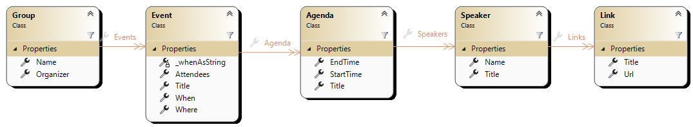

## Exercise 5A -LINQ built-in methods


In this exercise we'll practice usage of various LINQ built-in extension methods on IEnumerable.  
The challenge is to load list of `Meetup` objects from JSON file and query information from them.

Load the list of meetups and query them
```csharp
void Main()
{
    var meetups = Meetup.DB.Load();
}
```

#### *Entities*


<small>

- Group : Collection of people and events that shares a common interest (i.e. C# Israel)
- Event : A Meeting/Gathering about a one or more subjects related to the group (i.e. .NET 8 - What's new in C#)
- Agenda : Schedule of meetings and activities during the event (i.e. 18:00-18:30 Pizza and Beer)
- Speaker : A person that delivers a presentation or talk on a specific topic (i.e John Doe - C# Expert at B.S.Corp)
- Link : A link to online website related to the Speaker (i.e. www.github.com/john-doe)
</small>

---

### Challenge 1 - LINQ Basics
**Difficulty:** Beginner  
**Time:** 15 min  
___
- **Select** the names of the meetup groups and convert them to UPPER-CASE
- **Select** only meetup groups names **where** their name contains the word **"Israel"** in them
- **Count** how many meetup groups contains the word **"Israel"** in them
- Calculate the **sum** of total events in all meetup groups
- **Order** the groups by the **Organizer** name,
  - **take** first 3 groups
  - **select** the group's **name** together with the **Organizer** name
  - Convert the sequence into a List

___
### Challenge 2 - Meetups Statistics
**Difficulty:** Intermediate/Experienced  
**Time:** 45 min  
___
Query the names of the meetup groups, order them by name (case-insensitive) and return the following statistics for each:  
- Meetup group name
- Number of events
- Latest (Most recent) event's Title and Date
- Has any event in that group ever had 200 or more attendees?
 
For this implement GetMeetupsStatistics():
```csharp
IEnumerable<MeetupStats> GetMeetupsStatistics(Meetup.DB meetups)

public struct MeetupStats
{
    public string Name;
    public int EventsCount;
    public double AverageAttendees;
    public string LatestEventTitle;
    public DateTime LatestEventDate;
    public bool EverHadAtLeast200Attendees;
}
```
##### &#x1F4A1; Make sure to exclude meetup groups without any events

> &#x1F381; Bonus
> If you sorted the events in order to find the most recent one (Latest Event),  
> Then optimized it without sorting  
  Hint: Use Aggregate() to find max date
___

### &#x1F381; Bonus Challenge 3 - MVP Speakers
**Difficulty:** Advanced  
**Time:** 45 min  
___
Query all the events' speakers which are Architects and have a GitHub repo.  
For this implement QueryArchitectsRepos() that returns a list of: 
Speaker name,title and the GitHub repo url
```csharp
List<(string Name, string Title, string Url)> QueryArchitectsRepos(Meetup.DB meetups)
```
The list should be ordered by the Speaker's name and without duplicates
