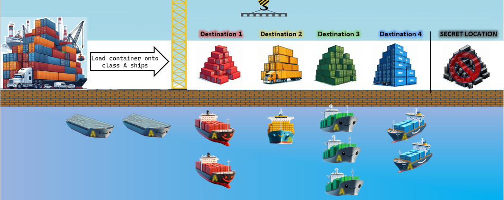
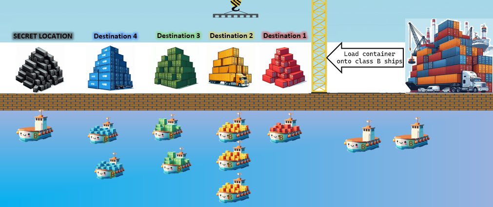
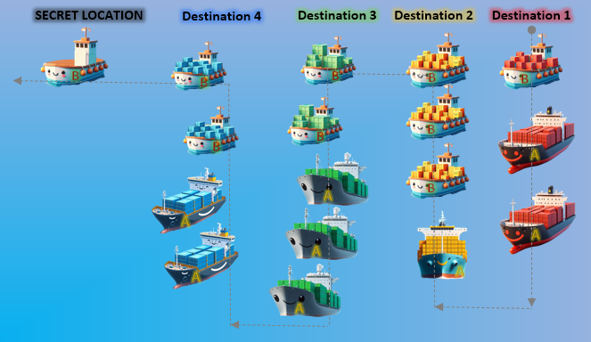

## Exercise 6A - LINQ Shipyard &#x1F30A;

**Difficulty:** Advanced/Expert  
**Time:** 4 hours  
___
In this exercise we'll practice the use of various LINQ capabilities mixed together:
- LINQ built-in functionalities
- Extending LINQ functionality with new extension methods
- Implementing custom business extension methods.  

### Challenge 1

- You need to load containers (`class ZimContainer`) onto ships and send them to their destination
- For this, we use ships of class A (`class ShipClassA`) &#x26F5;.  
```csharp
GenerateContainers(50)
    .LoadContainerOntoClassAShips()
    .ForEach(ship => ship.SailToDestination());
```
1. Implement extension method **LoadContainerOntoClassAShips()**  
   ```csharp
   public static IEnumerable<ShipClassA> LoadContainerOntoClassAShips(this IEnumerable<ZimContainer> containers)
   ```
   The implementation should perform:
   1. Ships of class A &#x26F5; are &#x274C; **not** allowed to sail to **SECRET_LOCATION**, so filter out those containers.
   1. Each ship is sailing to one destination, so we cannot mix containers from different destination on the same ship.  
      Therefore **group** the containers by their destination (`ZimContainer.ShipTo`)
   1. Each ship is limited in number of containers it can carry, so divide each group into chunks,  
      each chunk contains no more than number of allowed containers (`ShipClassA.MAX_CONTAINERS`)  
      For this, implement extension method **ChunkContainers()**  
      ```csharp
      public static IEnumerable<IReadOnlyCollection<ZimContainer>> ChunkContainers(this IEnumerable<ZimContainer> containers, int size)
      ```
     1. For each destination and chunk above:
         1. Create a ClassA ship
         1. Load the chunk of containers onto it
         1. yield return the ship
1. Next, iterate the sequence of ships and send them to their destination  
   For this, use ForEach() extension method from exercise 5B  
   as shown in the example above


> &#x1F381; **BONUS 1**  
> In case LoadContainerOntoClassAShips() implementation didn't use SelectMany() try to use it.

___
### Challenge 2

- Same as previous challenge, But this time it's require to use ships of class B (`class ShipClassB`) &#x1F6A2;.  
  - Class B ship has maximum allowed weight (`ShipClassB.MAX_WEIGHT`)  &#x1F40B;
  - In addition to maximum allowed containers (`ShipClassB.MAX_CONTAINERS`).  
  - Class B ship can ship to **any** destination
  ```csharp
  GenerateContainers(200)
      .LoadContainerOntoClassBShips()
      .ForEach(ship => ship.SailToDestination());
  ```
1.  Implement extension method LoadContainerOntoClass**B**Ships() &#x1F6A2;  
  1. Instead of ChunkContainers() extension method, implement a more appropriate one **ChunkByWeight()** 
     ```csharp
     public static IEnumerable<IReadOnlyCollection<ZimContainer>> ChunkByWeight(this IEnumerable<ZimContainer> containers, int maxWeight, int maxContainers)
     ```
    
     It should create chunks, either with the number of allowed containers **or less**,   
     in order to ensure the accumulated weight of the containers don't exceed the limit.  

___
### Challenge 3
> TODO: add illustration image
- When loading containers onto a ship, the ship might malfunction and require repairs &#x1F477; &#x1F527;.  
  So there is a need to replace the ship with a new one.    
1. Implement extension method **ReplaceShip()** that will replace the faulty ship with a new one  
   and take its containers to the destination.  
   ```csharp
   public static IEnumerable<T> ReplaceShip<T>(this IEnumerable<T> ships, int shipId, T newShip) where T : Ship
   ```

```csharp
GenerateContainers(50)
    .LoadContainerOntoClassAShips()
    .ReplaceShip(shipId: 2, newShip: new ShipClassA())
    .ForEach(ship => ship.SailToDestination());
```

___
### Challenge 4

- It was decided to join list of ships class A and list of class B, that ship to the same **destination**.  &#x26F5; + &#x1F6A2;
1. Implement extension method JoinAndGroupShipsByDestination() that will ensure ships for same destination are consecutive  
   ```csharp
   ILookup<ShipDestination, Ship> JoinAndGroupShipsByDestination(this IEnumerable<Ship> ships, IEnumerable<Ship> moreShips)
   ```
1. Arrange the ships within each group so that the heavier ones will sail first  &#x1F3CB;&#x2192;&#x1F98B;  
   For that, implement extension method **OrderShipsInEachDestination()**  
   ```csharp
   public static IReadOnlyDictionary<ShipDestination, IEnumerable<Ship>> OrderShipsInEachDestination(this IEnumerable<IGrouping<ShipDestination, Ship>> ships)
   ```
   - In case there are ships that weight the same, then further order them also by number of containers on board,  
     having those with more containers come first. &#x1F4E6;&#x1F4E6;&#x1F4E6;&#x2192; &#x1F381;
   - Lastly, in case the number of containers is the same, then also order by the ship **ID**.  
1.  Next, order the groups of ships for each destination, by the destination **name**  
    For that, implement extension method OrderByDestination()  
    ```csharp
    public static IEnumerable<KeyValuePair<ShipDestination, TDontCare>> OrderByDestination<TDontCare>(this IEnumerable<KeyValuePair<ShipDestination, TDontCare>> groupsOfShips)
    ```

```csharp
var shipsClassA = GenerateContainers(50).LoadContainerOntoClassAShips().ReplaceShip(2, new ShipClassA());
var shipsClassB = GenerateContainers(50).LoadContainerOntoClassBShips();

ILookup<ShipDestination, Ship> shipsByDestination = shipsClassA.JoinAndGroupShipsByDestination(shipsClassB);
shipsByDestination.OrderShipsInEachDestination()
                  .OrderByDestination()
                  .ForEach(shipsForDestination =>
                  {
                      Console.WriteLine($"Shipping {shipsForDestination.Value.Count()} ships to {shipsForDestination.Key} ...");
                      shipsForDestination.Value.ForEach(ship => ship.SailToDestination());
                  });
```

___
> &#x1F381; **BONUS 2**  
> Similar to ChunkContainers(), implement a general purpose **Chunk()** extension method  
> ```csharp
> IEnumerable<IReadOnlyCollection<T>> Chunk<T>(this IEnumerable<T> source, int size)
> ```
___
> &#x1F525; **BONUS 3**  
> Similar to ChunkByWeight(), implement general purpose **ChunkByLimit()** extension method, suitable for any type of sequence  
> ```csharp
> IEnumerable<IReadOnlyCollection<T>> ChunkByLimit<T>(this IEnumerable<T> source, int limit, int maxChunkSize, Func<T, decimal> selector)
> ```
> &#x2139; The `selector` parameter is used to get the value to accumulate for the limit   
  i.e. `(ZimContainer container) => container.Weight`
___
> &#x26A1; **BONUS 4**  
> Overload ChunkByLimit to support long, float and **decimal** numeric limit parameter
___
